## LDTS_l09gr01 - BAD ICE

BAD ICE is a maze-based, strategy game where your goal is to collect every piece of fruit in each level. 
Each level is guarded by different monsters that you must avoid by creating and removing ice blocks.
The difficulty of each maze will increase as you progress through the levels.
Make use of the power-ups that randomly spawn on the map.
Your creativity and ability to think quick will be put to the test!

This project was developed by João Parada (up201405280@edu.fe.up.pt), João Cordeiro (up202205682@edu.fe.up.pt) and Luciano Ferreira (up202208158@edu.fe.up.pt) for LDTS 2023⁄24.

For a more detailed version of this description click [here](./docs/README.md).

Project based on [hero-solid](https://github.com/arestivo/hero-solid/).

## Screenshots

The following screenshots and gifs illustrate the general look of our game and menus:
### Game preview

  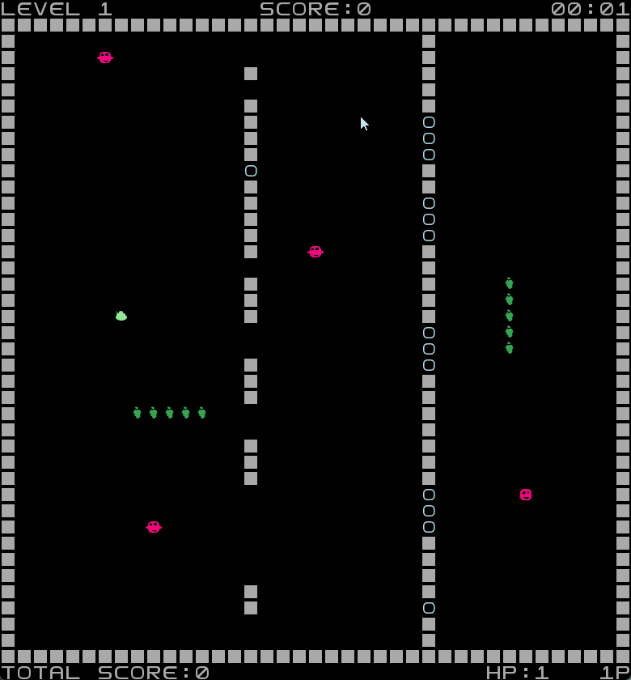

  <b><i>Gif 1. Level Example</i></b>

 
 

### Menus

  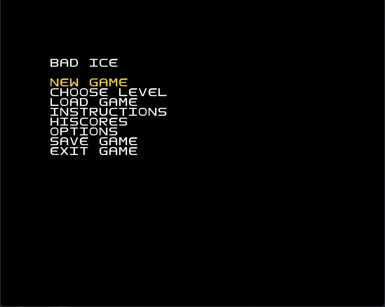

  <b><i>Fig 1. Main Menu </i></b>

  

 
 

  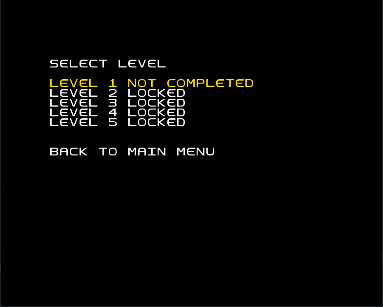

  <b><i>Fig 2. Level Selection Menu </i></b>  

  

 
 

  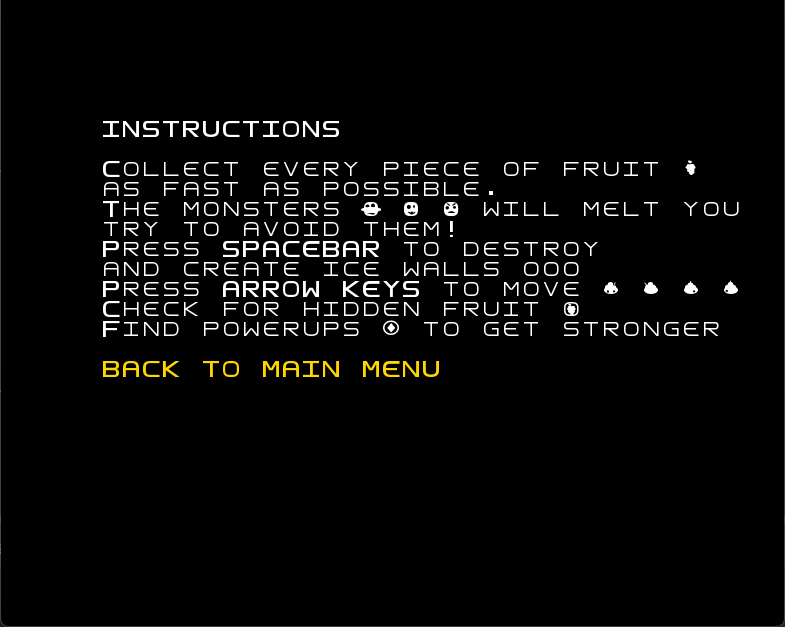

  <b><i>Fig 3. Instructions Menu </i></b>

  

 
 

  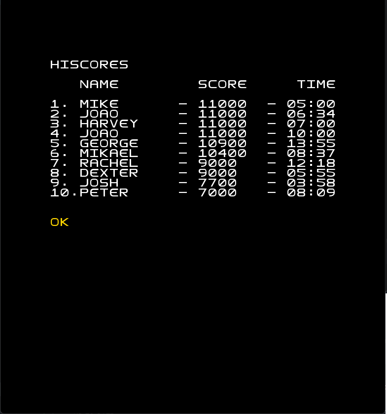

  <b><i>Fig 4. Hiscores Menu </i></b>

 
 

  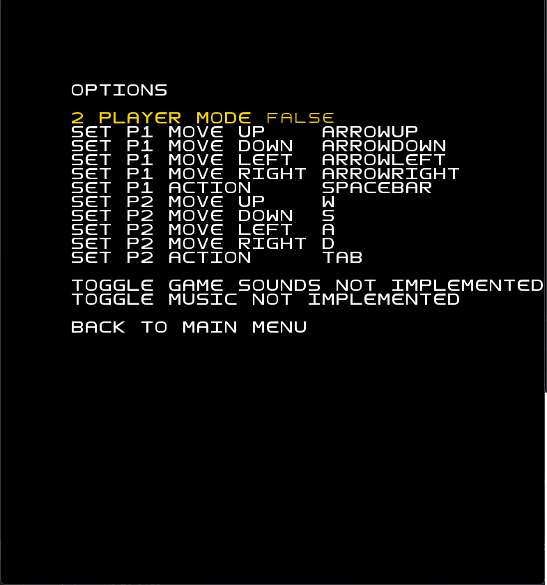

  <b><i>Fig 5. Options Menu </i></b>

 
 

### Levels

  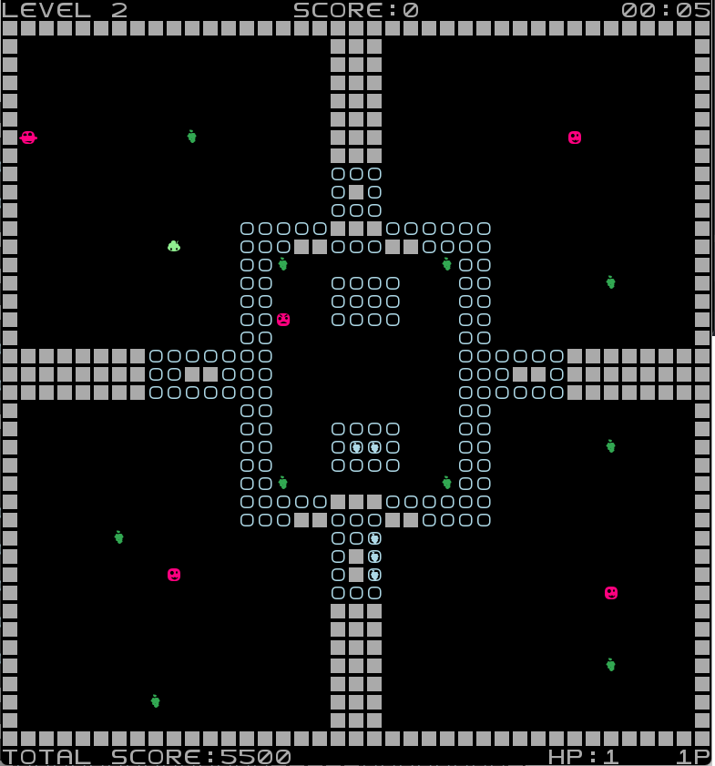

  <b><i>Fig 5. Level 2 </i></b>

 
 

  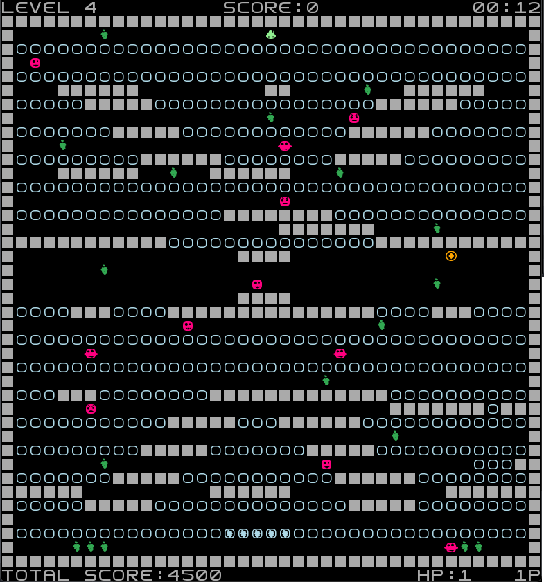

  <b><i>Fig 6. Level 4 </i></b>

 
 

### Strategy

  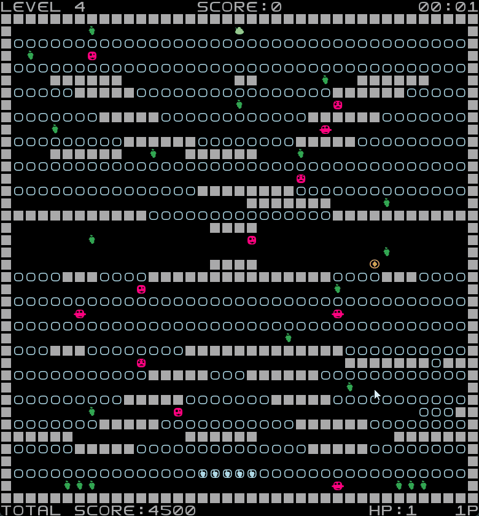

  <b><i>Gif 2. Manipulate the ice to your advantage</i></b>

 
 

### End Game

  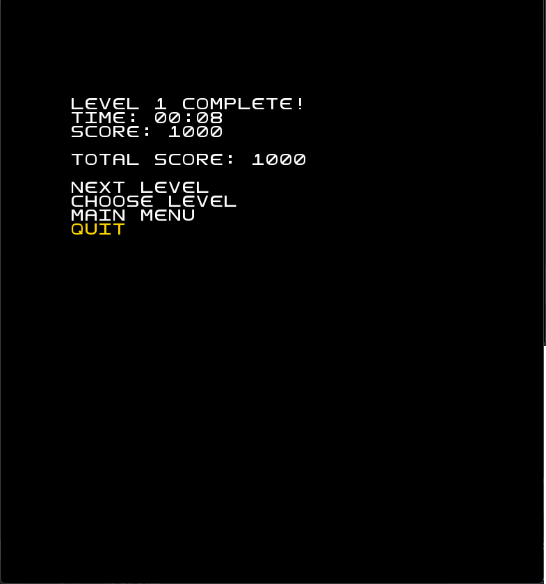

  <b><i>Fig 7. Level Completed Menu</i></b>

 
 

  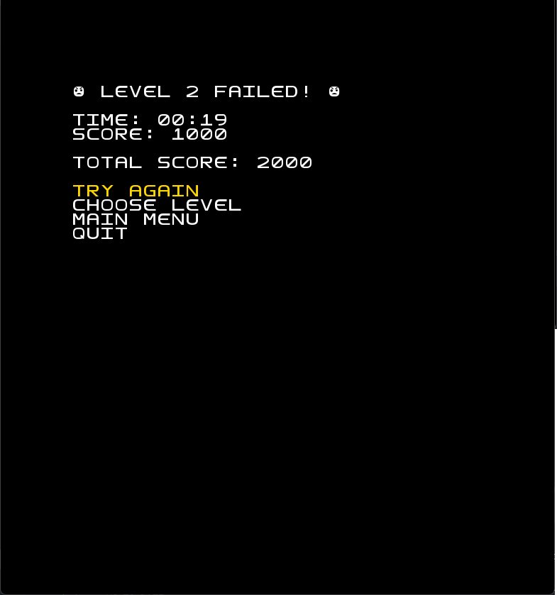

  <b><i>Fig 8. Level Failed Menu</i></b>

### Two-Player Mode

  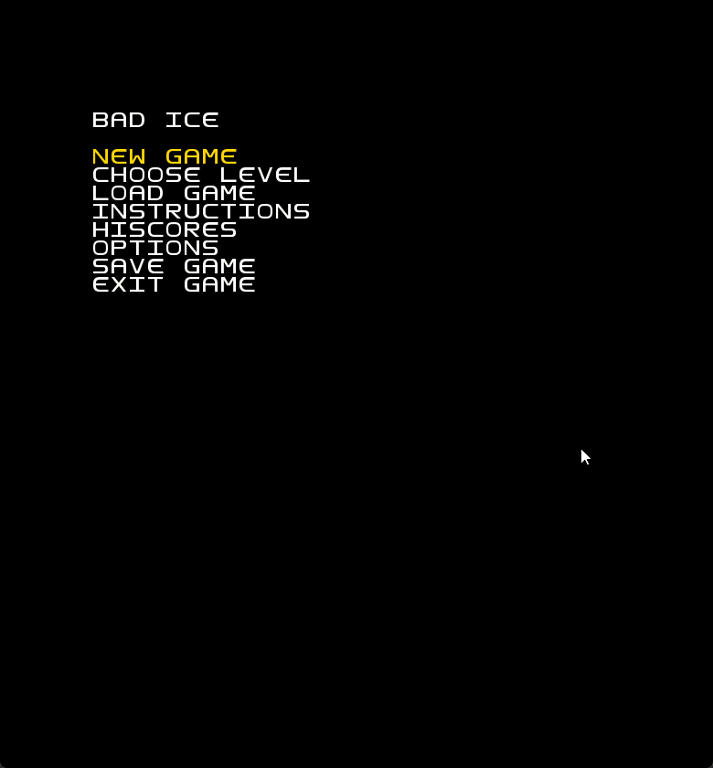

  <b><i>Gif 3. Supports Two-Player Mode</i></b>

 
 
