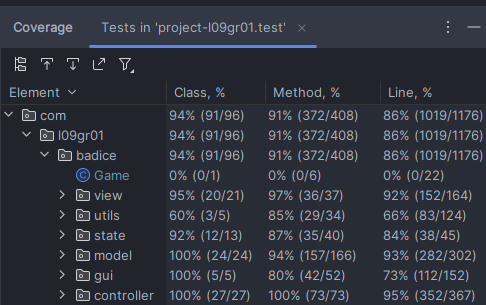

## LDTS_l09gr01 - BAD ICE

BAD ICE is a maze-based, strategy game where your goal is to collect every piece of fruit in each level.
Each level is guarded by different monsters that you must avoid by creating and removing ice blocks.
The difficulty of each maze will increase as you progress through the levels.
Make use of the power-ups that randomly spawn on the map.
Your creativity and ability to think quick will be put to the test!

This project was developed by João Parada (up201405280@edu.fe.up.pt), João Cordeiro (up202205682@edu.fe.up.pt) and Luciano Ferreira (up202208158@edu.fe.up.pt) for LDTS 2023⁄24.

### IMPLEMENTED FEATURES

- **Connected Menus** - The user has the capability of browsing through the different menus including in game ones. (Ex: Main Menu, Instructions, Hiscores, Options, Pause, etc.).
- **Hiscores Functionality** - The game keeps track of the player's total score and game time and will prompt the user to register his/her name into the Hiscores list.
- **Level Unlocking** - The user is locked out of the advanced levels until each previous level is beaten.
- **Saving and Loading** - The user is able to save his/her level progress, as well as the total score and game time to a file, so it can be loaded in another game instance.
- **Different Levels** - 5 different levels with an increasing difficulty were implemented.
- **Customizable Keybinds** - The user has the capability to reassign keybinds to his/her preference.
- **Two-Player Mode** - The game supports up to two simultaneous players.
- **Different Monster types** - There are 3 different types of monsters, each with different behaviour relative to the player(s) position.
### PLANNED FEATURES

- **Game sound** - Getting hit by a monster, collecting fruit, hitting a wall, collecting and using power-ups, completing level, losing level all should play different sounds.
- **Music** - Menu music and in-game music.

## DESIGN

### General Structure
#### Problem in Context:
The first step of the creation of our game was deciding what the core structure would look like.
Since we had to make use of Lanterna GUI, we opted to take a similar approach to the "Hero" game that we also worked on during the Lab lessons.

### **Singleton Pattern:**

The starting point of our game is the **_Singleton_** class [Game](../src/main/java/com/l09gr01/badice/Game.java).

**Implementation**

At any point during the application runtime there is only one instance of this class and it propagates its own **state** to the other classes.

  

  <b><i>Fig 1. Singleton Pattern</i></b>

#### Consequences:
The use of this pattern simplified the structure of our program and made it so it was easy to change the current **state** in a linear way.

### **State Pattern:**

Already referenced on the singleton pattern, this pattern allows the game to change its behaviour in run-time.

**Implementation**

We implemented several different states that the game can have and transit between.
Most of them are menu states but there's also one in-game state.

#### Consequences:
Anytime the game has to drastically change its behaviour it can now do so by changing to a different state.
Since each state has its own **controller**, **viewer** and **model** the transition between two states is explicit.

### **Model-View-Controller Pattern**

Perhaps the most important pattern used for the design of our game, this architectural pattern divides the application into three parts.

**Implementation**

-Model: This part contains the storable data of each element or menu.

-View: This part has the responsibility to display the data stored by the model to the user.

-Controller: As the name indicates, this part controls the way each model interacts with the game (game logic).

For example, in the class [Arena](../src/main/java/com/l09gr01/badice/model/game/arena/Arena.java)
you can see many class variables that will be manipulated and rendered by the [ArenaController](../src/main/java/com/l09gr01/badice/controller/game/ArenaController.java)
so that the class [GameView](../src/main/java/com/l09gr01/badice/view/game/GameView.java) can display to the user.

#### Consequences:
As consequence of using this pattern, it is possible to manage and maintain each component of the game independently. 
We can easily change the user interface (View) without touching the data (Model) associated, for example.
The code also became well organized and follows the Single Responsibility Principle.

### **Factory Method**

As a follow-up to the State and MVC patterns, the factory method is used by the application as a form to propagate
parameters to subclasses before deciding exactly what type of objects are to be created.

**Implementation**

The implementation of this pattern consists on the abstract class [State](../src/main/java/com/l09gr01/badice/state/State.java) 
referencing a generic model "T" to its View and Controller(which are also abstract classes) so they can be implemented
by each different subclass.

**Consequences**

This pattern also enhances the flexibility of the code by allowing the subclasses to determine the type of objects
to be created. Since the details of object creation are within the subclasses, it helps the code to adhere to the
Single Responsibility Principle.

### KNOWN CODE SMELLS

Even though we have fixed all errors and warning reported by error-prone, the following code smells might still be present:

-The use of static classes such as GameStats and HiscoresManager made testing much more complicated;

-Any inconsistency with the [hiscores.txt](../data/hiscores.txt) will crash the application on file access.
Running ./gradlew pitest will also delete the contents of that file.

-Some long methods (in [ArenaController](../src/main/java/com/l09gr01/badice/controller/game/ArenaController.java) for example)
might be challenging to understand at first sight, even thought they have low time complexities.

-Even thought we don't think the Single Responsibility Principle is violated, there are some large classes such as
[Arena](../src/main/java/com/l09gr01/badice/model/game/arena/Arena.java).

## TESTING

### Screenshot of coverage report

  

  <b><i>Fig 2. Code coverage screenshot</i></b>

### Screenshot of Pit Test Coverage Report

  

  <b><i>Fig 3. Pit Test Coverage Report screenshot</i></b>

### Link to mutation testing report
[Mutation tests](../docs/pitest/index.html)

### SELF-EVALUATION

Luciano designed the custom font and worked on some controller algorithms like moveMonster(). (10%)

João Cordeiro designed the levels, helped with the UML diagram, created some tests and worked on the initial class structure. (20%)

Everything else was developed by João Parada. (70%)

